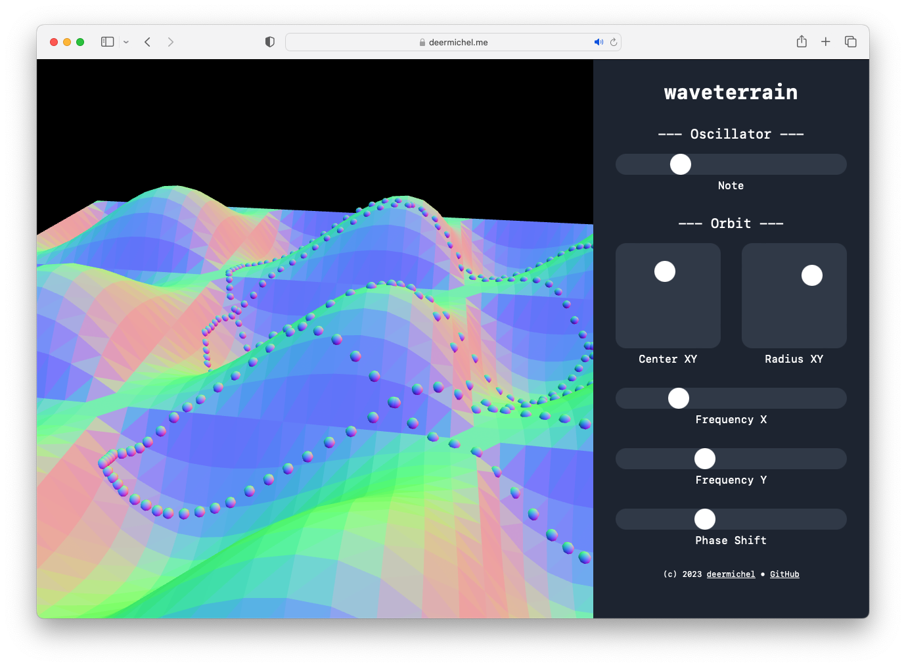

# waveterrain

Try it: [deermichel.me/waveterrain](https://deermichel.me/waveterrain/)

[](https://github.com/deermichel/waveterrain/actions/workflows/deploy.yml)


Imagine taking a 3D terrain and interpreting the height values along a path as samples of an audio signal. 
That's the concept behind wave terrain synthesis.

Inspired by [this](https://mu.krj.st/assignments/osc_s.html) article, I created an interactive demo that allows you to explore wave terrain synthesis directly in your browser.
It is at the same time my playground for cutting edge [web stuff](#tech-stack).

This project is explicitly open for contributions, and if you need inspiration, just pick one of the items from the [roadmap](#roadmap).
If you have any further questions or want to discuss an idea, feel free to reach out to me.

Should this project become mature enough, I consider packaging it as a VST/AU plugin so that it can be used in other audio software.

## Roadmap
- [ ] Intro animation
- [ ] Audio effects
- [ ] Oscillator ADSR
- [ ] Experiment with stereo audio (e.g. via phase shift)
- [ ] Input text fields
- [ ] Record and share (maybe also parameters)
- [ ] Prettier landscape rendering, use height for color
- [ ] Help and descriptions, e.g. keyboard shortcuts
- [ ] MIDI input, MIDI learn for parameters ("Mapping" tab)
- [ ] Gamepad input
- [ ] Fix no sound on iOS when mute switch is on
- [ ] Move audio processing code to WebAssembly
- [ ] Display orbit and terrain functions
- [ ] More orbits and terrains
- [ ] Modulate parameters
- [ ] Plot synthesized wave ("Analyze" tab, FFT?)
- [ ] Make it a full plugin (sponsoring?)
- [ ] Refactor code :)

## Tech Stack
- [three.js](https://threejs.org/) - for the gorgeous 3D visualization
- [Web Audio API](https://developer.mozilla.org/en-US/docs/Web/API/Web_Audio_API) - specifically the `AudioWorkletProcessor` for sound synthesis
- [emscripten](https://emscripten.org/) - moving the audio processing code to WebAssembly is still a TODO
- [svelte](https://svelte.dev/) - people said it's the new React, okay
- [tailwind.css](https://tailwindcss.com/) - maybe i'm doing it wrong, but i'd have preferred plain css
- [TypeScript](https://www.typescriptlang.org/) - always a good idea
- [vite](https://vitejs.dev/) - who likes webpack anyway

## Build Instructions
```sh
# clone repo
git clone https://github.com/deermichel/waveterrain.git

# install dependencies
cd waveterrain
npm install

# build and start dev server
npm run dev
```

## License
This project is released under the [MIT License](LICENSE).
